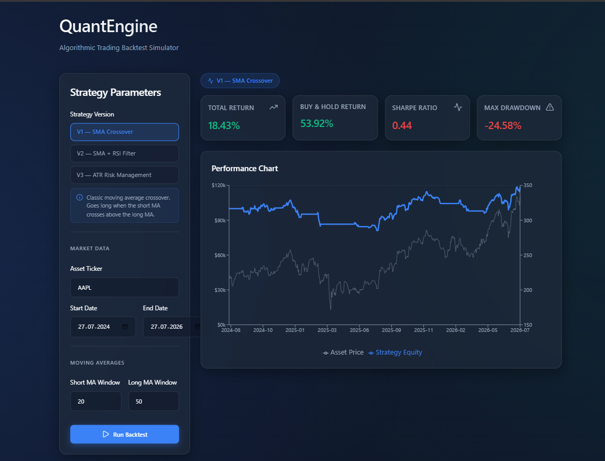
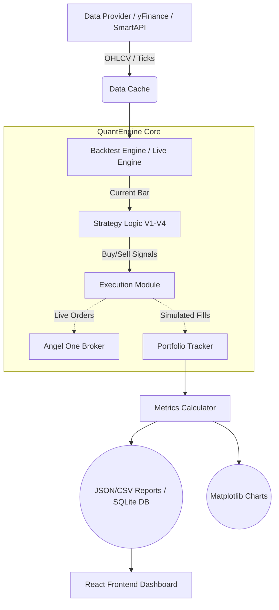

<div align="center">
  <h1>📈 QuantEngine Trading Bot</h1>
  <p><strong>A professional, modular, and production-ready backtesting & live-execution framework for quantitative trading.</strong></p>

  [](https://www.python.org/)
  [](https://reactjs.org/)
  [](https://www.typescriptlang.org/)
  []()

  <br />
  
</div>

---

## 📖 Table of Contents
- [About the Project](#-about-the-project)
- [Tech Stack](#-tech-stack)
- [Architecture](#-architecture)
- [Key Features](#-key-features)
- [Getting Started](#-getting-started)
  - [Backend Setup](#backend-setup)
  - [Frontend Setup](#frontend-setup)
- [CLI Usage Guide](#-cli-usage-guide)
  - [1. Backtesting](#1-backtesting)
  - [2. Optimization](#2-optimization)
  - [3. Reporting](#3-reporting)
- [Web Dashboard Usage](#️-web-dashboard-usage)
- [Trading Strategies](#-trading-strategies)
- [Performance Metrics](#-performance-metrics)

---

## 🌟 About the Project

**QuantEngine** is a fully customized trading bot architecture featuring a professional backtesting framework, a **production-ready live trading engine**, and a modern web interface. 

It solves common algorithmic trading pitfalls like **look-ahead bias** and **curve-fitting** by enforcing a strictly chronological, bar-by-bar backtesting engine and providing advanced walk-forward optimization analysis. Moreover, it seamlessly transitions profitable strategies into live execution via direct broker integration.

---

## 💻 Tech Stack

The project is split into a robust Python engine and a highly responsive React dashboard.

### **Backend (Algorithmic Engine)**
* **Language:** Python 3.9+
* **Data Retrieval:** `yfinance`, SmartAPI (Angel One)
* **Data Processing:** `pandas`, `scipy`, `pytz`
* **Execution/Broker:** Custom Adapter architecture (Mock & Angel One supported)
* **Configuration:** `pyyaml`, Dataclasses, `.env`
* **Testing:** `pytest` (54-test suite guaranteeing execution accuracy)

### **Frontend (Analytics Dashboard)**
* **Framework:** React 19 + Vite
* **Language:** TypeScript
* **Styling:** Vanilla CSS (Modern, dark-theme UI)
* **Charting:** `recharts`
* **Icons:** `lucide-react`
* **API Client:** `axios`

---

## 🏗 Architecture



---

## 🔥 Key Features

- 🛡️ **Zero Look-Ahead Bias**: Replays historical data chronologically. Calculates indicators strictly on historical bounds.
- 💱 **Realistic Execution**: Incorporates percentage-based commission fees, dynamic slippage simulation, and exact mid-bar Stop-Loss/Take-Profit triggers.
- 🚀 **End-to-End Live Trading**: Connects directly to **Angel One API** via TOTP authentication to execute real market orders.
- 🚦 **Robust Guardrails**: Built-in protections including **Max Daily Loss** circuits, **Market Hour** constraints (NSE), state synchronization on crashes, and dynamic ATR Trailing Stops.
- 🧪 **Advanced Optimization**: Exhaustive Grid Search, large-space Random Search, and rigorous **Walk-Forward Analysis** to detect and prevent overfitting.
- 📊 **Beautiful Visualization**: Generates bespoke chart types (Equity Curve, Drawdown, Monthly Returns Heatmap) and provides a full live-monitoring Dashboard.

---

## 🚀 Getting Started

Follow these instructions to get a copy of the project up and running on your local machine.

### Backend Setup

1. **Clone the repository**
   ```bash
   git clone https://github.com/Anupthakurr/trading-bot.git
   cd "trading bot/backend"
   ```

2. **Create a Virtual Environment**
   ```bash
   python -m venv venv
   # On Windows:
   venv\Scripts\activate
   # On Mac/Linux:
   source venv/bin/activate
   ```

3. **Install Dependencies**
   ```bash
   pip install -r requirements.txt
   ```

4. **Environment Configuration (For Live Trading)**
   Copy `backend/.env.example` to `backend/.env` and fill in your Angel One API credentials:
   ```env
   ANGELONE_API_KEY=your_actual_api_key_here
   ANGELONE_CLIENT_CODE=your_actual_client_code_here
   ANGELONE_PASSWORD=your_actual_password_here
   ANGELONE_TOTP_SECRET=your_actual_totp_secret_here
   ```

5. **Start the API Server** (Required for the frontend dashboard)
   ```bash
   python -m uvicorn main:app --reload
   ```

### Frontend Setup

1. **Navigate to the frontend directory**
   ```bash
   cd ../frontend
   ```

2. **Install Node modules**
   ```bash
   npm install
   ```

3. **Run the Development Server**
   ```bash
   npm run dev
   ```

---

## ⚙️ CLI Usage Guide

The backend includes powerful Command Line Interface (CLI) tools. All commands must be run from the `backend/` directory.

### 1. Backtesting (`backtest.py`)

Run a historical backtest for a given symbol and strategy. The framework will automatically fetch data, run the simulation, calculate metrics, and output visual charts.

```bash
# Basic run for V4 on AAPL Daily
python backtest.py --symbol AAPL --timeframe 1D --strategy v4 --start 2023-01-01 --end 2024-01-01

# Run multiple symbols on a 1-hour timeframe using V3
python backtest.py --symbol BTC-USD,ETH-USD --timeframe 1h --strategy v3
```

**Outputs:** Located in `backend/results/SYMBOL_strategy_TF/`. Includes `report.html`, `summary.json`, `trades.csv`, and `.png` charts.

### 2. Optimization (`optimize.py`)

Search for the most profitable parameters.

```bash
# Exhaustive grid search
python optimize.py --symbol MSFT --strategy v4 --method grid

# Fast random search (best for large parameter spaces)
python optimize.py --symbol SPY --strategy v3 --method random --iterations 500

# Advanced walk-forward analysis (detects overfitting)
python optimize.py --symbol NVDA --strategy v4 --method walk-forward
```

### 3. Reporting (`report.py`)

Compare and list your backtest runs.

```bash
# List all previous backtest runs
python report.py --list

# View a detailed summary of a specific run
python report.py --results results/AAPL_v4_1D

# Compare multiple runs side-by-side
python report.py --compare results/AAPL_v3_1D results/AAPL_v4_1D
```

---

## 🖥️ Web Dashboard Usage

QuantEngine features a modern React-based frontend that provides a beautiful, interactive analytics dashboard and full live-trading controls.

### 1. Starting the Application
Make sure you have both the backend (`uvicorn`) and frontend (`npm run dev`) running. Open `http://localhost:5173`.

### 2. Live Trading Dashboard
- **Engine Controls:** Select your broker (Mock Paper Trading vs Angel One Live), input your ticker, choose a strategy, and set your risk threshold.
- **Active Monitoring:** The dashboard streams real-time state from your backend SQLite database, displaying Open Positions, P&L, Order History, and Account Balance.
- **Activity Log:** A live terminal feed streams every execution event, rejection reason, and tick logic evaluation directly to your browser.

---

## 🧠 Trading Strategies

The framework includes 4 built-in strategy engines mapped in `framework/strategies/`:

1. **V1 (SMA Crossover)**: The classic trend-following strategy using Fast and Slow Simple Moving Averages.
2. **V2 (SMA + RSI)**: Moving average crossover heavily filtered by the Relative Strength Index (RSI) to prevent buying in overbought territory.
3. **V3 (ATR Risk Management)**: Introduces dynamic volatility risk management using the Average True Range (ATR) to size positions and set trailing stops.
4. **V4 (Enhanced Momentum)**: A professional grade strategy utilizing Fast/Slow EMAs, MACD histograms for confirmation, RSI thresholds, and dynamic ATR trailing stops.

---

## 📈 Performance Metrics

The engine calculates **15+ professional quantitative metrics**, outputted perfectly formatted to the terminal and JSON:
- **Returns**: Total Return, Annualized Return, Buy & Hold Return.
- **Risk-Adjusted**: Sharpe Ratio, Sortino Ratio, Calmar Ratio.
- **Market Comparison**: Jensen's Alpha, Beta (automatically fetched vs SPY benchmark via `yfinance`).
- **Trade Stats**: Win Rate, Average Profit/Loss, Expectancy, Profit Factor.
- **Drawdown**: Maximum Drawdown (calculated peak-to-trough dynamically).

---

<div align="center">
  <i>Developed and maintained for QuantEngine.</i>
</div>
